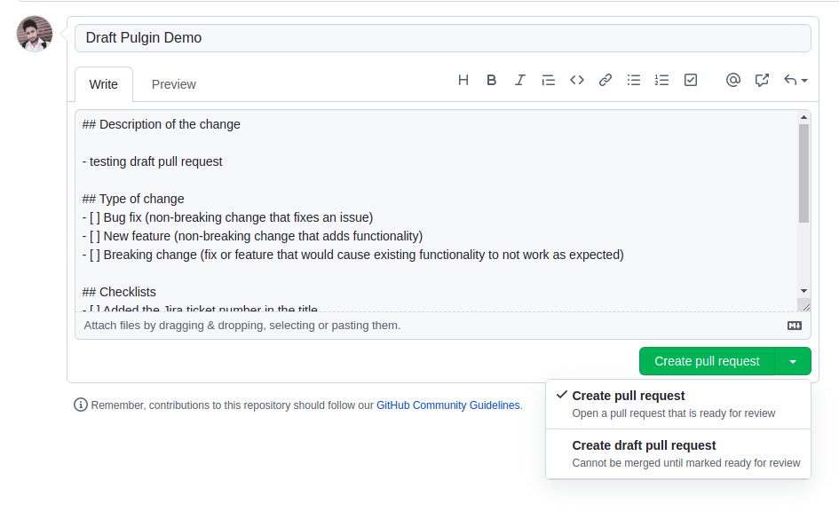
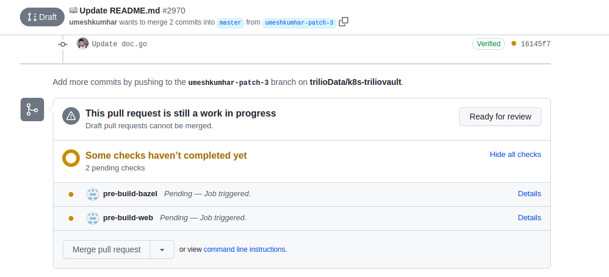
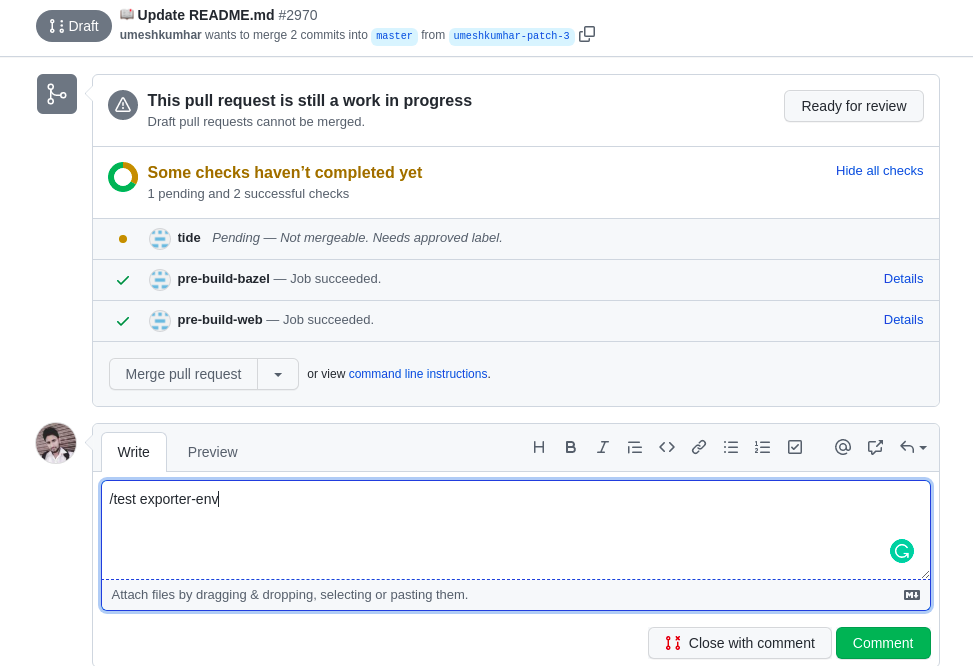
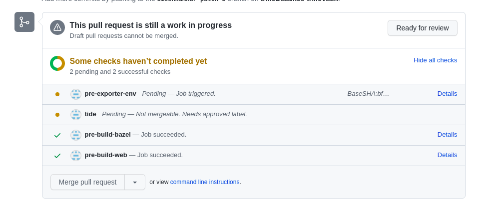
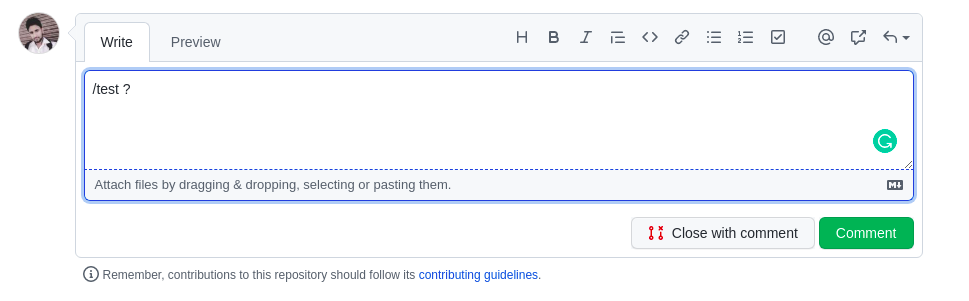
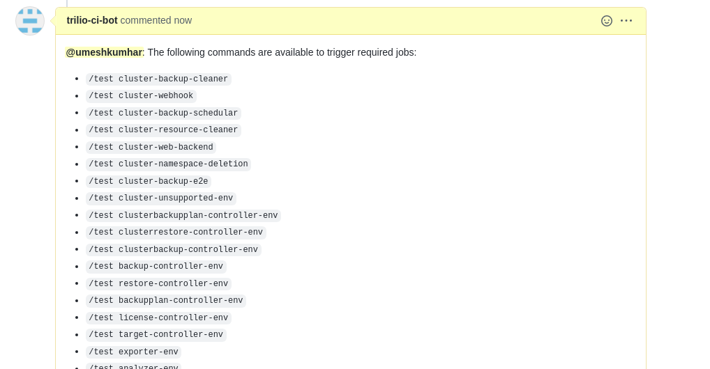
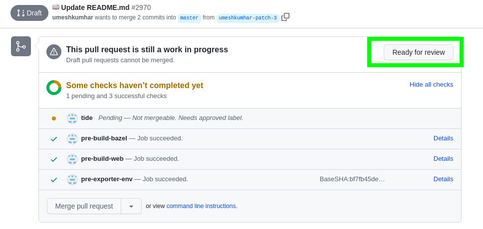
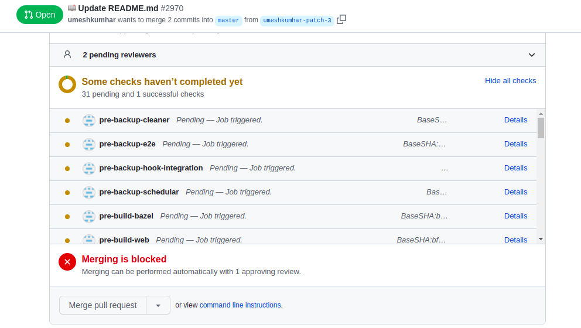
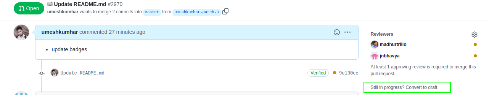

# Prow Draft Pull Request Plugin

## Introduction
The goal of the plugin is to restrict the number of prow jobs that normally runs on pull request. Since /ok-to-test cannot be applied on trusted members pull request in prow CI/CD.
To rescue that we have a plugin that can run your basic build jobs on your draft pull request and not entire test suites.

## Background
Prow is integrated with the external plugin which is exposed as server that will receive GitHub events of user PR activity, accordingly plugin will handle the job execution as per requirements.
In our case,
- **Draft PR**: Run only build jobs on every commit and not other jobs
- **PR**: Once Draft PR is ready for review, then prow will execute all required jobs to validate new changes.

## Instruction for Developers
- Draft Pull Request
    - First always raise Draft Pull Request if you are still working on it, and created for review only.
    - If developer is working for any particular test job, then they should manually trigger that prow jobs using comment such as `/test pre-webhook` on their PR. To run such tests, there is no hard requirement to move the Draft PR to PR.
    - By default, only build jobs will be running in Draft Pull Request.
-  Pull Request
    - If there is any inProgress work on the Pull Request, we suggest moving that to Draft Pull Request
    - Ideally all WIP Pull Request should be Draft Pull Request

## Usage
Normally there are following use-cases:

1. **Developer will be going to create fresh Draft Pull Request**
    1. Developer will create first Draft PR instead of Normal Pull Request on GitHub console.
      
    2. he can observe grey icon for Draft Pull Request and your build jobs will be triggered automatically.
       
    3. To run any jobs maually just comment `/test trigger-name`
       
       
    4. If you are not sure about the trigger-name then you can comment `/test ?` and prow bot will print list all possible jobs he can trigger for you.
       
       
    5. Once you are confident to review and merge, you can move Draft Pull Request to Ready For Review.
       
    6. Developer can observe all required jobs are in execution once PR is raised.
       
2. **Developer already has a Pull Request, that needs to be moved in Draft Pull Request**
    1. If Pull Request needs some major work to be done, then existing Pull Request can be converted to Draft Pull Request.
       
    2. And you will fall in first use-case again!

## Issues
Facing any issues? Do raise it on GitHub, we will more than happy to help you out!